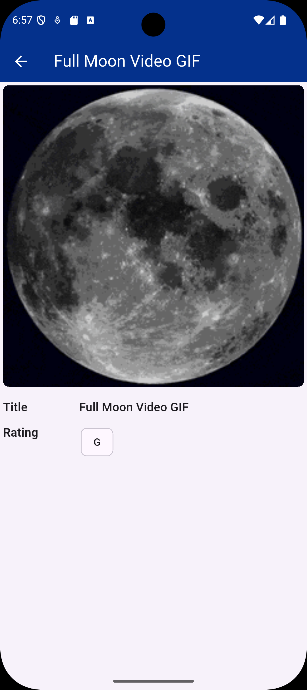

# Giphy Search App

A Flutter application that lets users search and browse GIFs using Giphy API.

- Built and tested with **Flutter 3.41.0** and **Dart 3.11.0**

## Features

- Auto-search with debounce
- Infinite scroll pagination
- GIFs displayed in a responsive grid (adapts to screen width and orientation)
- Detailed single GIF view
- Loading indicators
- Error handling

## Architecture

- BLoC (flutter_bloc) for state management
- Repository pattern for API communication
- DTO models (Freezed + JSON Serializable) for parsing

## Running the App

An API key from Giphy Developers is required and must be injected at build time using --dart-define.
Supported platforms: Android and iOS(untested)

**Android**
```bash
flutter run --dart-define=ANDROID_GIPHY_KEY=YOUR_ANDROID_KEY
```

**iOS**
```bash
flutter run -d ios --dart-define=IOS_GIPHY_KEY=YOUR_IOS_KEY
```
## Screenshots
<table>
  <tr>
    <td></td>
    <td></td>
  </tr>
</table>

